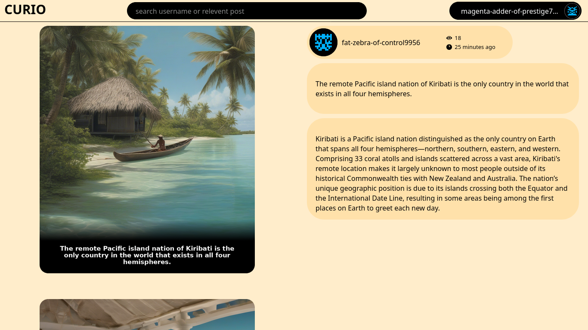
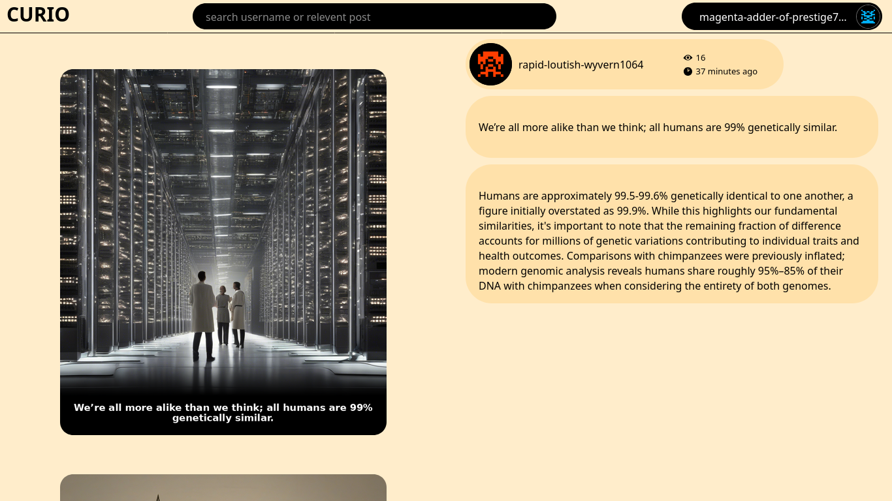
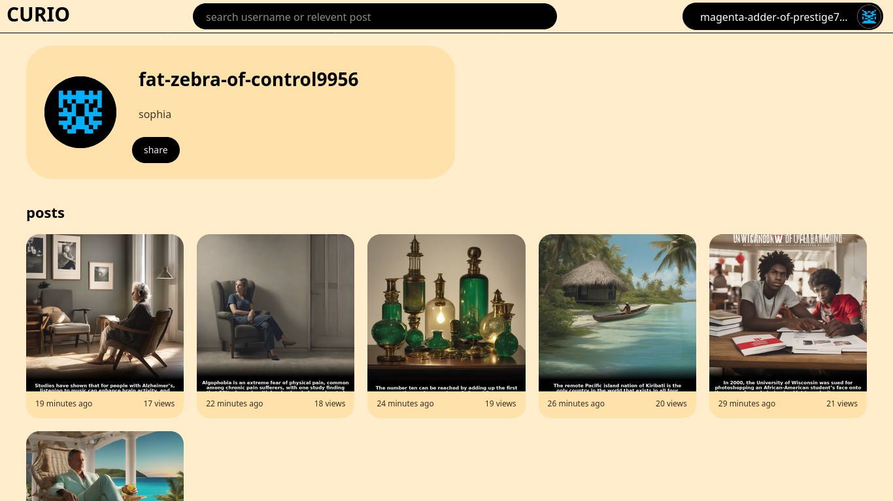
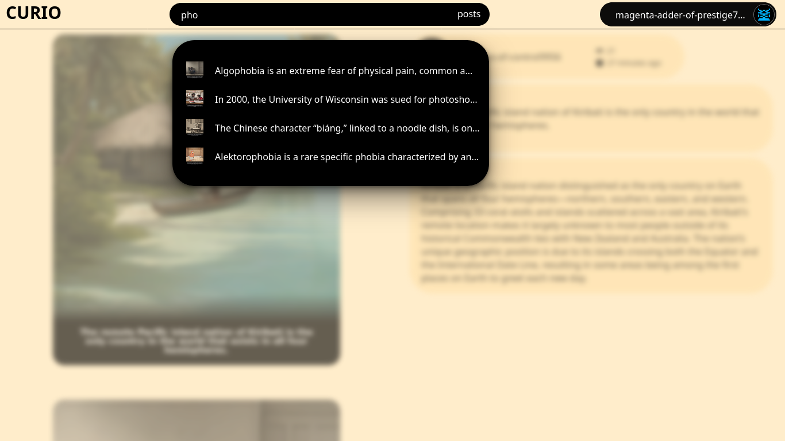
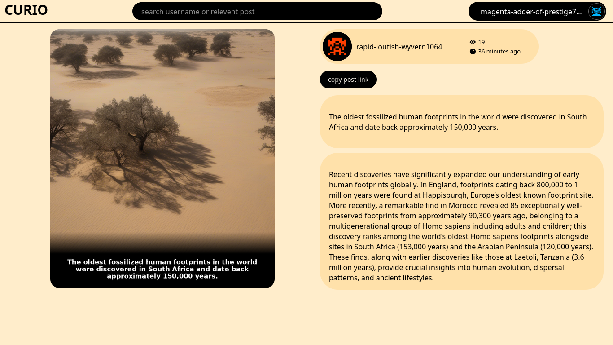

# CURIO

**Content Using Research & Intelligent Output**


CURIO is an AI-powered SaaS platform that discovers trending facts, researches them across the web, and generates shareable meme posts — complete with captions, AI-generated imagery, and research-backed context.

Originally a local post-creation pipeline, CURIO has evolved into a full multi-user web application with authentication, profiles, an explore feed, search, privacy controls, and usage quotas.

---

## Features

- **7-stage AI pipeline** — Scrape facts → select topic → research → write caption → generate image → compose final post → publish
- **Multi-user SaaS** — Sign up, profiles, avatars, and session-based auth
- **Explore feed** — Discover public posts from all users with infinite scroll
- **Shareable URLs** — Direct links to posts (`/{post_id}`) and profiles (`/{username}`)
- **Privacy controls** — Toggle posts between public and private
- **Search** — Find users by username or posts by keyword
- **Background creation** — Service worker runs the pipeline and notifies when ready
- **Usage quotas** — Free-tier post limits per account

---

## Screenshots

<div align="center">









### Demo Video

https://github.com/user-attachments/assets/video.mp4

</div>

---

## Quick Start

### Prerequisites

- Python 3.12+
- MongoDB 4.4+ running on `localhost:27017`
- OpenAI-compatible LLM API key
- Self-hosted image generation API (see [Image Generation API](documentations/13-image-generation-api.md))

### Setup

```bash
git clone https://github.com/bravecoconut/curio.git
cd curio

python3 -m venv .venv
source .venv/bin/activate

pip install -r requirements.txt

cp .env.example .env
# Edit .env with your API keys

python -m app.server
```

Open **http://localhost:5000** → sign up with any email and password → create your first post from your profile page.

---

## Environment Variables

| Variable | Description |
|----------|-------------|
| `BASE_URL` | OpenAI-compatible LLM provider base URL |
| `API_KEY` | LLM API key |
| `RESONNING_MODEL` | Model name for chat completions |
| `IMAGE_MODEL_BASE_URL` | Self-hosted image generation API endpoint |

See [`.env.example`](.env.example) for a template.

---

## Tech Stack

| Layer | Technology |
|-------|------------|
| Backend | Python, Flask, Beanie (MongoDB ODM) |
| Database | MongoDB |
| LLM | OpenAI-compatible API (topic, caption, research, prompts) |
| Image gen | Self-hosted API endpoint (via `IMAGE_MODEL_BASE_URL`) |
| Image edit | Pillow |
| Scraping | requests, BeautifulSoup, DuckDuckGo |
| Frontend | Jinja2 templates, vanilla JavaScript |
| Notifications | Service Worker API |

---

## Project Structure

```
curio/
├── app/                  # Flask application
│   ├── server.py         # Routes and entry point
│   ├── auth/             # Authentication
│   ├── stages/           # 7-stage AI pipeline
│   ├── post/             # Post services
│   ├── user/             # User services
│   ├── templates/        # HTML pages
│   └── static/           # CSS, JS, assets
├── data/json/            # Pipeline config and state
├── rage/post/            # Generated post images
├── documentations/       # Full documentation
├── frontend/             # Future React SPA (scaffold)
├── requirements.txt
└── .env.example
```

---

## Documentation

Full documentation is in the [`documentations/`](documentations/) directory:

| Document | Description |
|----------|-------------|
| [Overview](documentations/01-overview.md) | Product vision and features |
| [Architecture](documentations/02-architecture.md) | System design and data flow |
| [Getting Started](documentations/03-getting-started.md) | Local setup guide |
| [Content Pipeline](documentations/04-content-pipeline.md) | 7-stage AI workflow |
| [API Reference](documentations/05-api-reference.md) | REST API documentation |
| [Data Models](documentations/06-data-models.md) | MongoDB schemas |
| [Authentication](documentations/07-authentication-and-sessions.md) | Auth and sessions |
| [Frontend & UI](documentations/08-frontend-and-ui.md) | Web interface |
| [Configuration](documentations/09-configuration.md) | Environment setup |
| [Project Structure](documentations/10-project-structure.md) | Repository layout |
| [Deployment](documentations/11-deployment.md) | Production guide |
| [SaaS Features](documentations/12-saas-features.md) | Multi-user capabilities |

---

## API Overview

**Base URL:** `http://localhost:5000/api`

| Method | Endpoint | Description |
|--------|----------|-------------|
| `POST` | `/api/auth_service` | Sign up or log in |
| `POST` | `/api/create_post` | Run AI pipeline |
| `GET` | `/api/get_one_post/<id>` | Fetch a post |
| `POST` | `/api/get_explore_posts` | Public feed |
| `GET` | `/api/user/<username>` | Public profile |
| `POST` | `/api/search/profiles` | Search users |
| `POST` | `/api/search/posts` | Search posts |

See the full [API Reference](documentations/05-api-reference.md).

---

## Content Pipeline

```
Stage 1  Scrape daily facts (thefactsite.com)
Stage 2  LLM selects best topic, deduplicate used topics
Stage 3  Web search → scrape → AI summarize research
Stage 4  LLM writes dark-humor meme caption
Stage 5  LLM prompt → FLUX.1 image generation
Stage 6  PIL overlay: caption + fade on image
Stage 7  Save to MongoDB + write PNG
```

See [Content Pipeline docs](documentations/04-content-pipeline.md) for details.

---

## License

This project is provided as-is. Add your preferred license before public release.

---

## Contributing

1. Fork the repository
2. Create a feature branch
3. Make your changes
4. Submit a pull request

See [Project Structure](documentations/10-project-structure.md) to understand the codebase layout.
